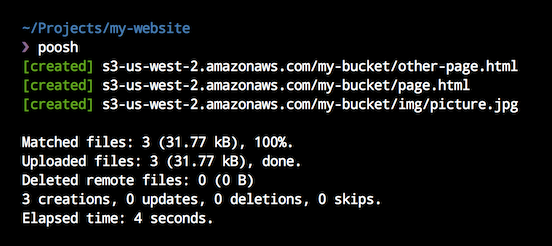

# poosh

> Publish local files to virtually any remote endpoint

[](https://travis-ci.org/yvele/poosh)
[](https://codecov.io/github/yvele/poosh)
[](LICENSE)




## Short Example

Install [poosh CLI][poosh-cli] and [S3 plugin][poosh-plugin-s3]:

```shell
> npm install -g poosh-cli poosh-plugin-s3
```

Create a `.poosh.json5` file at the root of your project:

```json5
{
  plugins : ["s3"],
  baseDir : "./deploy",
  remote  : "s3-us-west-2.amazonaws.com/my-bucket",

  each: [{
    headers   : { "cache-control": { cacheable: "public" } }
  }, {
    match     : "**/*.{html,css,js}",
    gzip      : true,
    headers   : { "cache-control": { maxAge: "48 hours" } }
  }, {
    match     : "**/*.{jpg,png,gif,ico}",
    gzip      : false,
    headers   : { "cache-control": { maxAge: "6 months" } }
  }, {
    match     : "**/*.html",
    priority  : -1
  }]
}
```

You can now upload:

```shell
> poosh
```

Or sync if you want to delete remote files that has been locally removed:

```shell
> poosh sync
```

## Main Features

[Glob Selection](#glob-selection) |
[GZIP](#gzip) |
[HTTP Headers](#http-headers) |
[Upload Ordering](#upload-ordering) |
[Automatic Redirection](#automatic-redirection) |
[Cache](#cache) |
[Simulation](#simulation)

Poosh allow you to upload and sync local files to virtually any remote destination.

### Glob Selection

Using the [match](#each) [option](#options),
local files that needs to be uploaded can be selected and configured with a [glob] string:

```json5
{
  each: [{
    match: "**/*.html"
  }]
}
```

or an array of patterns

```json5
{
  each: [{
    match: ["*.*", "!*.txt"]
  }]
}
```

Some supported glob features are:

| Feature | Example
| ------- | --------
| [Brace Expansion](https://github.com/jonschlinkert/braces) | `"foo/bar-{1..5}.html"`, `"one/{two,three}/four.html"`
| Typical glob patterns | `"**/*"`, `"a/b/*.js"`
| Logical OR | <code>"foo/bar/(abc&#124;xyz).js"</code> |
| Regex character classes | `"foo/bar/baz-[1-5].jpg"`
| POSIX [bracket expressions](https://github.com/jonschlinkert/expand-brackets) | `"**/[[:alpha:][:digit:]]/"`
| [extglobs](https://github.com/jonschlinkert/extglob) | <code>"**/+(x&#124;y)"</code>, <code>"!(a&#124;b)"</code>, etc.

### GZIP

Using the [GZIP](#each) [option](#options), files can be compressed at remote destination:

```json5
{
  each: [{
    match : "**/*.html",
    gzip  : true
  }]
}
```

`content-encoding` HTTP header will accordingly be set to `gzip`.

### HTTP Headers

Using the [headers](#headers) [option](#options),
HTTP headers can be configured for each files:

```json5
{
  each: [{
    match : "**/*.html",
    headers: {
      "cache-control": {
        maxAge      : "60 days",
        cacheable   : "public",
        noTransform : true
      },
      "content-disposition" : "attachment; filename=\"foo.html\"",
      "content-encoding"    : "utf-8",
      "content-language"    : "en-us",
      "content-length"      : 500,
      "content-md5"         : "Q2hlY2sgSW50ZWdyaXR5IQ==",
      "content-type"        : "text/html; charset=utf-8",
      "expires"             : "0",
      "location"            : "http://www.zombo.com"
    }
  }]
}
```

`content-encoding`, `content-length` and `content-type` HTTP headers are automatically generated by default.

### Upload Ordering

Sometimes some files must be uploaded before other ones to avoid inconsistency.
The [priority](#each) [option](#options) can be used to order uploads:

```json5
{
  each: [{
    match     : "**/*.html",
    priority  : -1
  }]
}
```

Greatest values are uploaded first.

### Automatic Redirection

Using the [header-location-from-html](packages/poosh-plugin-header-location-from-html) plugin,
the `location` HTTP header can be automatically generated from a file HTML [http-equiv](http://www.w3schools.com/tags/att_meta_http_equiv.asp) meta tag:

```json5
{
  plugins: ["header-location-from-html"],
  each: [{
    match     : "**/*.html",
    headers   : { location: { fromContent: true } }
  }]
}
```

### Cache

When local files are processed, a `.poosh.cache` file is generated next to the `.poosh.json5` configuration file.

Consecutive runs of poosh will use this file to avoid unnecessary remote requests.

[Poosh CLI][poosh-cli] can be used with the `--force` options to bypass cache lookup:

```shell
> poosh --force cache
```

The cache file is written after each individual file processing
(using the great [NeDB append-only format](https://github.com/louischatriot/nedb#persistence)).
Cache file stores 3 separate hash keys for each processed local file:
  - File content hash key
  - HTTP headers hash key
  - Remote options hash key

This is useful to poosh to detect distinctive local changes in either file content, HTTP headers and remote options.

### Simulation

Using the [CLI][poosh-cli] `--readonly` option,
no changes will be maid while output still showing potential changes:

```shell
> poosh --readonly
```

or

```shell
> poosh sync --readonly
```

## Options

| Option       | Default | Description
| ------------ | ------- | -------------
| plugins      | `[]`    | List of plugins to load and use. A single plugin is designed by it's package name (with or without it's `poosh-plugin-` prefix).
| baseDir      | `null`  | The base directory of local files. This path can either be absolute or relative (to the configuration file).
| remote       | `null`  | The remote client or a key/value map of remote clients to use for processing files.
| concurrency  | `3`     | File processing concurrency.
| each         | `[]`    | List of items used to select and process local files. Available options are described in the [each section](#each).

### Each

All "each" items are applied to files **in order**. Same options are overriden by the last one.

| Option       | Default     | Description
| ------------ | ----------- | -------------
| match        | `null`      | A [glob] string used to match files. If not specified, other options are applied to all files without marking them "to be processed".
| priority     | `null`      | Greatest values are processed first.
| gzip         | `false`     | If true, will gzip the file in remote destination.
| headers      | `[]`        | List of [headers options](#headers).
| remote       | `"default"` | The [key of the remote client](#options) to use. Or an object with an `id` key and some other ones that will define specific remote client options.

### Headers

Options used to control file's HTTP headers.

<table>
  <tr>
    <th>Option</th>
    <th>Default</th>
    <th>Description</th>
  </tr>
  <tr>
    <td>cache-control</td>
    <td><code>null</code></td>
    <td>
      String or object. The object can be a combination of the following keys:
      <ul>
        <li>
          <strong>maxAge</strong>:
          A number (of seconds) or a string that will be parsed by
          <a href="https://github.com/rauchg/ms.js">ms</a>.
          For example
          <code>"60 days"</code>,
          <code>"2.5 hrs"</code>,
          <code>"1 month"</code>,
          <code>"2h"</code>,
          etc.
        </li>
        <li>
          <strong>cacheable</strong>:
          Can be one of the following values:
          <code>null</code>,
          <code>"public"</code>,
          <code>"private"</code>,
          <code>"no-cache"</code>.
          </li>
        <li>
          <strong>noTransform</strong>:
          Boolean.
        </li>
      </ul>
      All those keys are <code>null</code> by default.
    </td>
  </tr>
  <tr>
    <td>content-disposition</td>
    <td><code>null</code></td>
    <td>String.</td>
  </tr>
  <tr>
    <td>content-encoding</td>
    <td><code>null</code></td>
    <td>
      Content encoding header is automatically generated at runtime.
      Using this option will force the header to the specified value.
    </td>
  </tr>
  <tr>
    <td>content-language</td>
    <td><code>null</code></td>
    <td>String.</td>
  </tr>
  <tr>
    <td>content-length</td>
    <td><code>null</code></td>
    <td>
      Number.
      Content length header is automatically generated at runtime.
      Using this option will force the header to the specified value.
    </td>
  </tr>
  <tr>
    <td>content-md5</td>
    <td><code>null</code></td>
    <td>String.</td>
  </tr>
  <tr>
    <td>content-type</td>
    <td><code>null</code></td>
    <td>
      Content type header is automatically generated at runtime.
      Using this option will force the header to the specified value.
    </td>
  </tr>
  <tr>
    <td>expires</td>
    <td><code>null</code></td>
    <td>String.</td>
  </tr>
  <tr>
    <td>location</td>
    <td><code>null</code></td>
    <td>String.</td>
  </tr>
</table>

[glob]: https://github.com/jonschlinkert/micromatch#features
[poosh-cli]: packages/poosh-cli
[poosh-plugin-s3]: packages/poosh-plugin-s3
